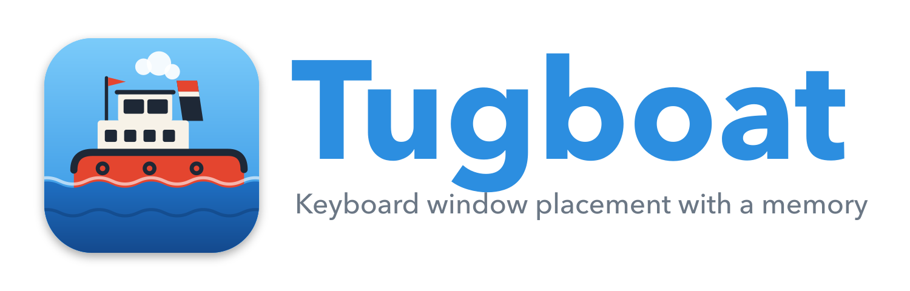

<p align="center">
  
</p>

Tugboat is a window manager for macOS that does two things:

1. **Places windows from the keyboard.** Halves, thirds, quarters, maximize, move between displays, snap areas when you drag a window to a screen edge. This half is [Rectangle](https://github.com/rxhanson/Rectangle), which Tugboat is forked from.
2. **Remembers where your windows go.** For every set of displays you use (laptop alone, laptop plus the office monitor, the two displays at home) Tugboat keeps track of where each window lives and puts it back when you dock, undock, wake the machine, or relaunch an app. *This half is under construction; see the roadmap.*

## Status

Early fork. The placement half is Rectangle 1.100 with a new name, icon, and bundle identifier. The arrangements half is being built in `Rectangle/Arrangements/`.

## System requirements

macOS 10.15 or later for window placement. Tugboat is built and tested on Apple silicon; Intel builds are expected to work.

## Installation

Download the latest `Tugboat-x.y.z.dmg` from the [Releases page](https://github.com/jduprat/Tugboat/releases), open it and drag Tugboat to Applications. Releases are ad-hoc signed and not notarized, so the first launch needs a right-click, Open, or approval under System Settings, Privacy & Security. After that Tugboat checks GitHub for new releases once a day and offers to install them in place, using Sparkle. You can turn the automatic check off in Settings.

To build it yourself:

```bash
git clone https://github.com/jduprat/Tugboat.git
cd Tugboat
xcodebuild -project Tugboat.xcodeproj -scheme Tugboat -configuration Release build
```

or open `Tugboat.xcodeproj` in Xcode and run the `Tugboat` scheme. On first launch Tugboat asks for Accessibility permission; a rebuild that changes the code signature will ask again.

Tugboat uses its own bundle identifier (`io.github.jduprat.Tugboat`), so it can be installed next to Rectangle. Do not run both at the same time, or every shortcut fires twice.

## How to use it

The keyboard shortcuts are listed in the menu bar menu and in Settings. Snap areas work by dragging a window to a screen edge; when the cursor reaches the edge you see a footprint of where the window will land when you release it.

| Snap area                                              | Resulting action                       |
|--------------------------------------------------------|----------------------------------------|
| Left or right edge                                     | Left or right half                     |
| Top                                                    | Maximize                               |
| Corners                                                | Quarter in respective corner           |
| Left or right edge, just above or below a corner       | Top or bottom half                     |
| Bottom left, center, or right third                    | Respective third                       |
| Bottom left or right third, then drag to bottom center | First or last two thirds, respectively |

### Tile the windows of one app

Beyond Rectangle's Rows and Columns, which tile every window on the display, Tugboat adds **Tile App Windows in Rows** and **Tile App Windows in Columns**. They act only on the windows of the app that has focus. Seven Terminal windows and one press of the Columns shortcut become seven tall strips across the display. Both are in the Tiling submenu once **Show additional sizes in menu** is on, and their shortcuts are set under Settings, General, Extras.

Hidden settings are changed from the terminal with `defaults write io.github.jduprat.Tugboat …`; see [TerminalCommands.md](TerminalCommands.md). Settings can be exported to and imported from JSON in Settings, and a file at `~/Library/Application Support/Tugboat/TugboatConfig.json` is offered for import at launch.

## Releasing

Push a tag such as `v0.2.0`. The release workflow builds the app, publishes the DMG as a GitHub Release, signs it with the Sparkle key held in the `SPARKLE_PRIVATE_KEY` repository secret, and commits the regenerated `appcast.xml` to main, which is the feed running copies check.

## Roadmap

| Phase | Scope |
|---|---|
| 1 | Display fingerprint, arrangement store, manual store and restore shortcuts, restore on display change |
| 2 | Automatic capture with debounce and a post-change freeze |
| 3 | Restore on app launch and window creation, with retries |
| 4 | Settings tab, stored-window editor, title regex matching |

Known limits shared with every tool of this kind: windows on other Spaces cannot be moved through public APIs, and Stage Manager reports misleading window frames.

## Relationship to Rectangle

Tugboat is a fork of [Rectangle](https://github.com/rxhanson/Rectangle) by Ryan Hanson, itself based on Spectacle by Eric Czarny, both MIT licensed. Upstream changes are merged regularly, and fixes to the shared placement engine are sent upstream where they fit. Rectangle Pro is a separate commercial product from the Rectangle author and is unrelated to Tugboat.

## Contributing

See [CONTRIBUTING.md](CONTRIBUTING.md).

## License

MIT. See [LICENSE](LICENSE).
