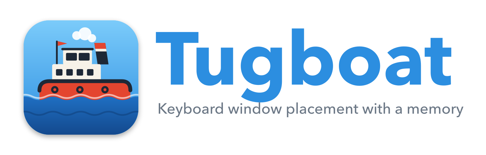

<p align="center">
  
</p>

Tugboat is a window manager for macOS that does two things:

1. **Places windows from the keyboard.** Halves, thirds, quarters, maximize, move between displays, snap areas when you drag a window to a screen edge. This half is [Rectangle](https://github.com/rxhanson/Rectangle), which Tugboat is forked from.
2. **Remembers where your windows go.** For every set of displays you use (laptop alone, laptop plus the office monitor, the two displays at home) Tugboat keeps track of where each window lives and puts it back when you dock, undock, wake the machine, or relaunch an app. The idea, down to storing a separate set of windows per display configuration, comes from [Stay](https://cordlessdog.com/stay/) by Cordless Dog, which has done this well since 2010; Stay is closed source, so none of its code is here, only the debt. *Saving and restoring by hand works today; automatic capture and restore are next, see the roadmap.*

## Status

Early fork. The placement half is Rectangle 1.100 with a new name, icon, and bundle identifier. The arrangements half is being built in `Tugboat/Arrangements/`.

## System requirements

macOS 14 or later. The deployment target follows the Xcode SDK's recommended minimum rather than a pinned number, so it rises when Apple raises it. Tugboat is built and tested on Apple silicon; Intel builds are expected to work.

## Installation

Download the latest `Tugboat-x.y.z.dmg` from the [Releases page](https://github.com/jduprat/Tugboat/releases), open it and drag Tugboat to Applications. Releases are ad-hoc signed and not notarized, so the first launch needs a right-click, Open, or approval under System Settings, Privacy & Security. After that Tugboat checks GitHub for new releases once a day and offers to install them in place, using Sparkle. You can turn the automatic check off in Settings.

To build it yourself:

```bash
git clone https://github.com/jduprat/Tugboat.git
cd Tugboat
xcodebuild -project Tugboat.xcodeproj -scheme Tugboat -configuration Release build
```

or open `Tugboat.xcodeproj` in Xcode and run the `Tugboat` scheme. On first launch Tugboat asks for Accessibility permission. Debug builds are signed with an Apple Development certificate so the permission survives rebuilds; the project names the maintainer's team, so pick your own under Signing & Capabilities. An ad-hoc signed build loses the permission every time it is rebuilt.

The current version is 0.2.0. Each build uses the number of commits reachable from the checked-out commit as its build number. The About panel records the full commit ID and whether the working tree was clean or dirty when built, including staged, unstaged, and nonignored untracked files. It also shows the branch name outside `main`, or “Detached HEAD” when building a checked-out commit or tag. Rebuilding the same commit keeps its build number. Builds require a full Git checkout so the count is accurate; generated metadata stays in Xcode’s derived data.

Tugboat uses its own bundle identifier (`io.github.jduprat.Tugboat`), so it can be installed next to Rectangle. Do not run both at the same time, or every shortcut fires twice.

## How to use it

Tugboat starts with Rectangle's recommended shortcuts, mostly ⌃⌥ plus an arrow or a letter, without asking; Settings can switch to the Spectacle set. The shortcuts are listed in the menu bar menu and in Settings. Snap areas work by dragging a window to a screen edge; when the cursor reaches the edge you see a footprint of where the window will land when you release it.

| Snap area                                              | Resulting action                       |
|--------------------------------------------------------|----------------------------------------|
| Left or right edge                                     | Left or right half                     |
| Top                                                    | Maximize                               |
| Corners                                                | Quarter in respective corner           |
| Left or right edge, just above or below a corner       | Top or bottom half                     |
| Bottom left, center, or right third                    | Respective third                       |
| Bottom left or right third, then drag to bottom center | First or last two thirds, respectively |

### Tile windows in rows, columns or a grid

| Shortcut | Action |
|---|---|
| ⌃⌥H | Tile every window on the display in rows |
| ⌃⌥V | Tile every window on the display in columns |
| ⌃⌥⇧H | Tile the focused app's windows in rows |
| ⌃⌥⇧V | Tile the focused app's windows in columns |
| ⌃⌥⇧G | Tile the focused app's windows in a grid |

Rows and Columns come from Rectangle, which has no default keys for them. The app-only actions work on the windows of whichever app has focus: seven Terminal windows and one press of ⌃⌥⇧V become seven tall strips across the display, or with ⌃⌥⇧G a 3 by 3 grid. All five are in the Tiling submenu once **Show additional sizes in menu** is on, and their shortcuts can be changed under Settings, General, Extras.

### Save and restore window positions

| Shortcut | Action |
|---|---|
| ⌃⌥⇧S | Save Window Positions: remember where every window on the current Space is |
| ⌃⌥⇧R | Restore Window Positions: put every remembered window that is open back where it was saved |

Both are also in the menu bar menu, and the shortcuts can be changed under Settings, General, Extras. Positions are kept per set of displays, one JSON file per set in `~/Library/Application Support/Tugboat/Arrangements/`, so the laptop alone and the laptop at the office desk each have their own. Saving again updates the windows that are open and keeps the rest. Restore is greyed out when nothing has been saved for the displays connected now. The file format is described in [docs/arrangements-design.md](docs/arrangements-design.md).

Hidden settings are changed from the terminal with `defaults write io.github.jduprat.Tugboat …`; see [TerminalCommands.md](TerminalCommands.md). Settings can be exported to and imported from JSON in Settings, and a file at `~/Library/Application Support/Tugboat/TugboatConfig.json` is offered for import at launch.

## Releasing

Push a tag such as `v0.2.0`. The release workflow builds the app, publishes the DMG as a GitHub Release, signs it with the Sparkle key held in the `SPARKLE_PRIVATE_KEY` repository secret, and commits the regenerated `appcast.xml` to main, which is the feed running copies check.

## Roadmap

| Phase | Scope |
|---|---|
| 1 | Display fingerprint, arrangement store, manual store and restore shortcuts, restore on display change |
| 2 | Automatic capture with debounce and a post-change freeze |
| 3 | Restore on app launch and window creation, with retries |
| 4 | Settings tab, stored-window editor, title regex matching |

Known limits shared with every tool of this kind: windows on other Spaces cannot be moved through public APIs, and Stage Manager reports misleading window frames.

## Relationship to Rectangle

Tugboat is a fork of [Rectangle](https://github.com/rxhanson/Rectangle) by Ryan Hanson, itself based on Spectacle by Eric Czarny, both MIT licensed. Upstream changes are merged regularly, and fixes to the shared placement engine are sent upstream where they fit. Rectangle Pro is a separate commercial product from the Rectangle author and is unrelated to Tugboat.

## Contributing

See [CONTRIBUTING.md](CONTRIBUTING.md).

## License

MIT. See [LICENSE](LICENSE).
